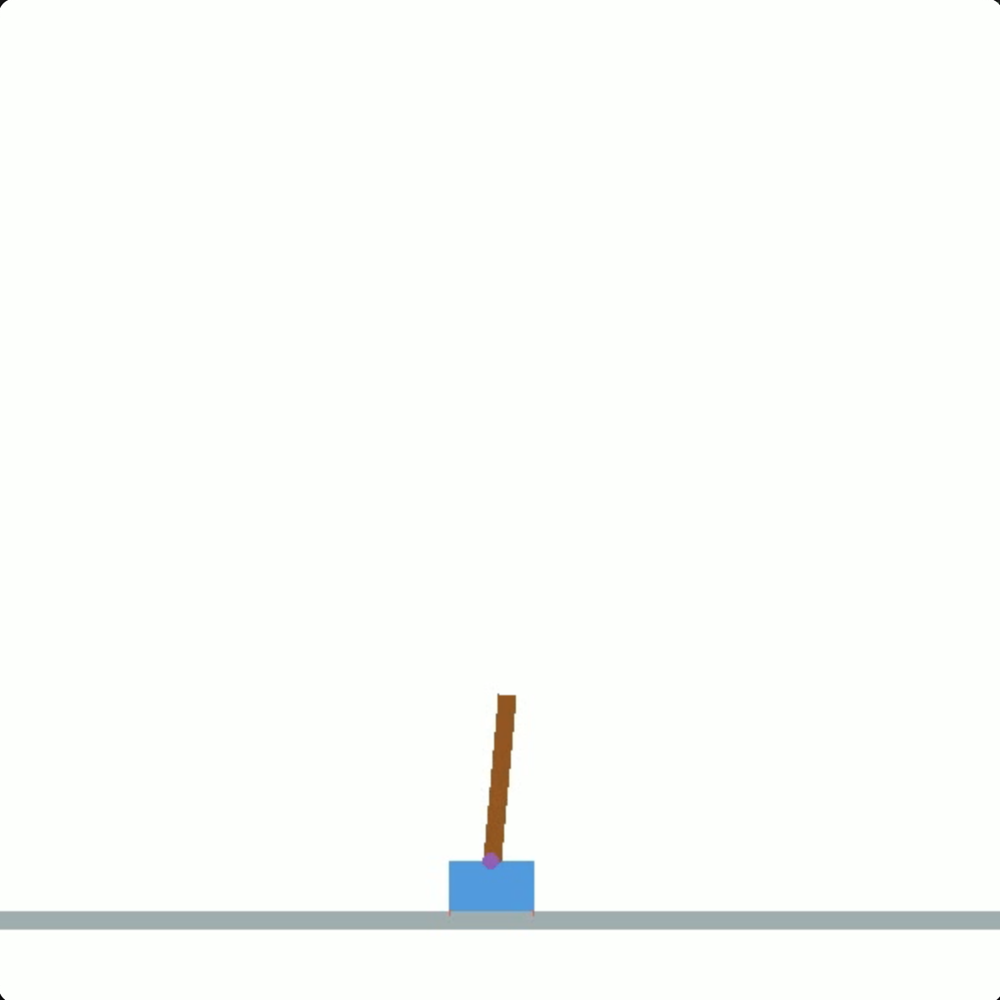
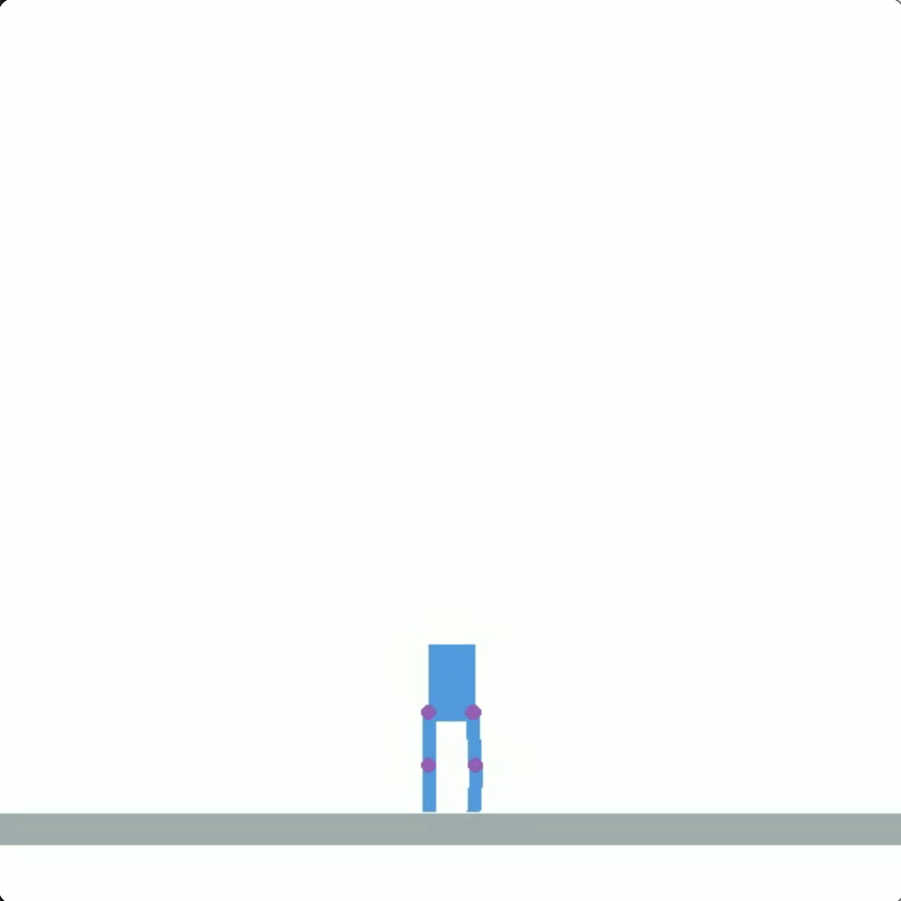
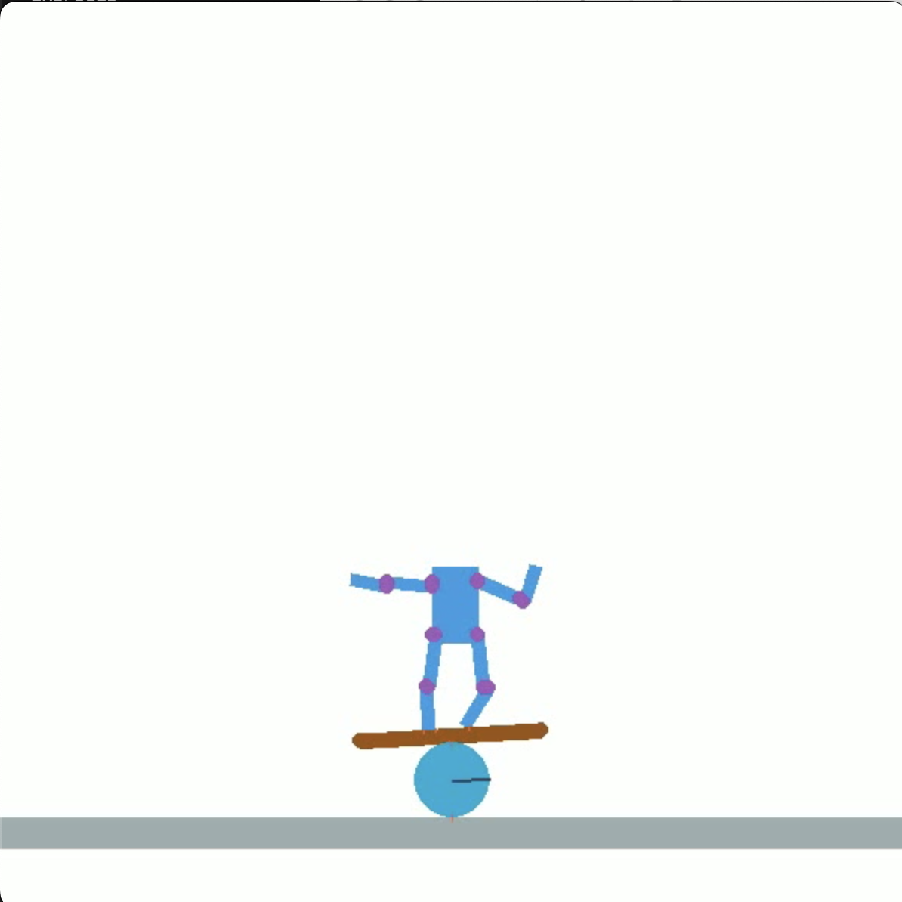
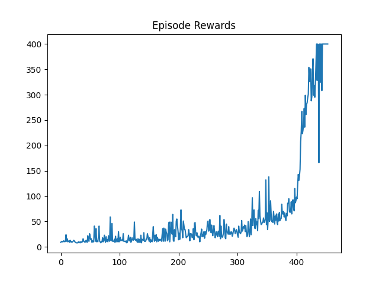
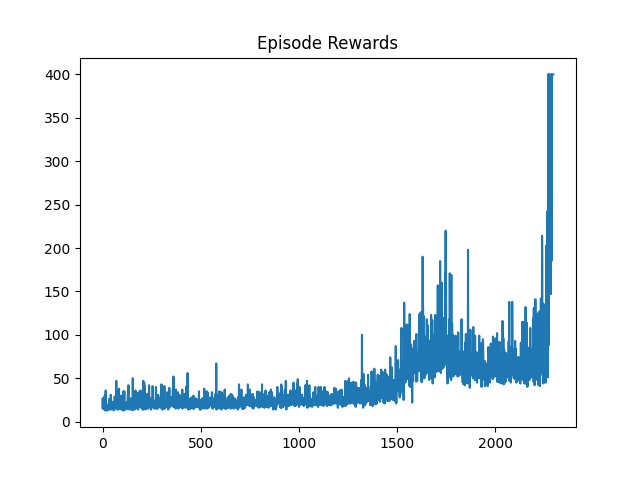
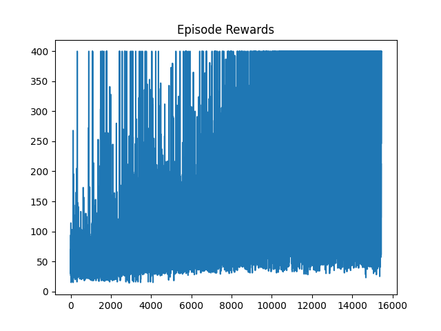

## Overview

This project is a Python codebase designed for training and testing reinforcement learning agents in various simulated environments using the Soft Actor Critic (SAC) method. The project's structure enables easy expansion, testing, and visualization of reinforcement learning algorithms. The project leverages the pymunk physics engine for in-house 2D physical simulation, providing a platform for testing and training machine learning agents. The project includes three distinct environments designed to challenge and develop the capabilities of AI agents:

* Cartpole Environment: A foundational test in reinforcement learning, where the agent aims to balance a pole atop a moving cart.

* Humanoid Standing Environment: A more complex scenario where the agent must maintain the balance of a standing humanoid figure, simulating bipedal stability.

* Humanoid Balance Ball Environment: An advanced and dynamic environment where the agent controls a humanoid figure balancing on a rolling ball, requiring sophisticated coordination and balance.

These environments serve as progressively challenging stages, pushing the boundaries of what the AI agents can learn and how they adapt to physical constraints within simulated realities.

## Project Structure

- **agent/**
  - **agent.py**: The agent.py file encapsulates the core functionality of the Soft Actor-Critic (SAC) agent within the project. The `SACAgent` class defined in this file employs the SAC algorithm, which operates under the principles of deep reinforcement learning. The algorithm is known for its stability and efficiency in learning policies for complex tasks.

    Key characteristics of the `SACAgent` include:

    - Utilization of separate neural network architectures for the actor, critic, and value networks, which are defined in the `networks.py` module.
    - The actor network determines the action based on the policy learned, while the critic networks evaluate the action by estimating the potential rewards.
    - A replay buffer implemented in `buffer.py` for storing and sampling experiences, facilitating experience replay, which is crucial for effective learning in complex and high-dimensional spaces.
    - Continuous learning and improvement through batch updates from the replay buffer and consistent updating of the target value network to stabilize learning.
    - Ability to save and load both the model weights and the replay buffer, allowing for interruption and resumption of training without loss of progress.
    - The `SACAgent` class accepts various parameters that can be fine-tuned for different environments and training scenarios, such as the learning rate, discount factor, batch size, and dimensions of the input observations. The default settings are geared towards a balance between performance and computational efficiency.

    To improve the agent's training performance, SAC employs a twin-critic mechanism which mitigates positive bias in the policy improvement step by taking the minimum value between two critic estimates. Furthermore, the use of a value network helps in stabilizing the training updates.

    The class also includes functions to select actions based on the current policy, save and load model checkpoints, and conduct learning updates. Each of these functions is carefully designed to interoperate within the project's infrastructure, ensuring that the agent can effectively learn from interactions with the provided environments.

  - **buffer.py**: The `buffer.py` module within the project contains the definition of the `ReplayBuffer` class, which is a fundamental component in modern reinforcement learning algorithms. Replay buffers address the issue of correlated training samples by storing experiences and allowing the agent to learn from a diverse sample of past experiences, which can be thought of as a form of memory that the agent can draw upon to improve its decision-making processes.

    Here's an expanded description of the `ReplayBuffer` and its functionalities:

    - Circular Buffer Mechanism: The `ReplayBuffer` uses a circular buffer mechanism to manage memory. When the buffer reaches its maximum capacity (`max_size`), it starts overwriting old memories with new ones. This ensures a consistent memory footprint and allows for the continual updating of experiences.

    - Sampling: The `sample_buffer` method facilitates unbiased sampling of transitions, crucial for the learning process. By randomly drawing samples from the buffer, it breaks the temporal correlations in the sequence of experiences, which is important for the stability of the learning algorithms.

    - Store Transition (Experience): Each transition consisting of the state, action, reward, subsequent state, and the done flag is stored in the buffer. This method efficiently manages the index of the latest transition using modular arithmetic, which is an elegant solution for updating the buffer in a circular manner.

    - Batch Learning: By enabling batch learning, the `ReplayBuffer` aligns with the needs of deep learning methods where learning from batches is more stable and efficient compared to single transition updates.

    - State Management: The buffer maintains a counter to track the total number of transitions stored. This is helpful not just for indexing but also for knowing how many samples are available for training at any point in time.

    Incorporating the `ReplayBuffer` into the `SACAgent`'s learning process allows the agent to benefit from experiences that are randomly distributed across the state-action space, making the learning process more robust and less prone to overfitting to recent experiences. This buffer plays a pivotal role in the agent's ability to generalize from past experiences and learn optimal behaviors.

  - **networks.py**: The `networks.py` module is a critical component of the project, containing the neural network architectures that form the decision-making core of the reinforcement learning agent. The module defines three separate neural network classes: `CriticNetwork`, `ValueNetwork`, and `ActorNetwork`, each with distinct roles in the Soft Actor-Critic (SAC) algorithm framework.

    - **Critic Network**
    The `CriticNetwork` class encapsulates the critic model in the SAC algorithm, responsible for evaluating the quality of actions taken by the agent. This network takes both the state and the action as input and outputs a Q-value, representing the expected reward for that action in the given state. It is implemented with two fully connected layers followed by an output layer that produces the scalar Q-value.

    - **Value Network**
    The `ValueNetwork` class represents the value network used in SAC, which estimates the value of being in a given state, regardless of the action taken. This state-value function helps in stabilizing the training and provides a baseline for the policy to improve upon. Similar to the `CriticNetwork`, it consists of two fully connected layers leading to an output layer that predicts the state value.

    - **Actor Network**
    The `ActorNetwork` defines the policy model of the agent, which proposes actions given the current state. It outputs a probability distribution over actions, characterized by a mean and standard deviation, from which actions are sampled. This stochastic policy allows the agent to explore the action space efficiently and is crucial for the exploration-exploitation trade-off in reinforcement learning. The network uses the reparameterization trick to sample actions in a way that is amenable to backpropagation.

    Each network uses leaky ReLU activations for the fully connected layers to allow a small gradient when the unit is inactive and none for the final output layers. The actor network employs softplus activation for the standard deviation to ensure it remains positive.

    All networks are subclassed from `keras.Model`, which provides a clean and modular way of building trainable models in TensorFlow. This design choice makes it easy to save and load models, facilitating experimentation with different architectures and hyperparameters. Moreover, each class includes attributes for checkpoint directories, streamlining the process of persisting and recovering training progress.

    These network architectures are pivotal to the functioning of the SAC algorithm, which relies on the interplay between the policy (actor) and value estimation (critic and value networks) to learn optimal actions while managing uncertainty and exploration. The modular structure of these classes ensures that they can be easily adapted or extended for future enhancements to the algorithm or adjustments to different environments within the project.

- **environment/**
  - **environment.py**: The `environment.py` module in the project introduces a foundational framework for creating custom 2D simulated environments in which reinforcement learning agents can be trained and evaluated. It leverages `pymunk` for physics simulation and `pygame` for rendering, alongside `cv2` (OpenCV) for video capture and image processing functionalities. This versatile combination allows for both the accurate simulation of physics and the visual rendering needed for observation and analysis.

    The `BaseEnvironment` class serves as a template for all custom environments within the project. It defines a general structure and sets out essential functionalities that all derived environment classes must implement.

    The class is initialized with configuration parameters such as screen size and frames per second (FPS), which are essential for the simulation's timing and visual representation. A flag, `enable_rendering`, determines whether the environment will be rendered visually, which is critical for debugging and visual analysis but can be disabled to speed up training when visual output is unnecessary.

    Upon initialization, if rendering is enabled, the `pygame` library is set up, and a screen surface for rendering is created. Additionally, an offscreen surface is prepared for recording the simulation, which allows for the creation of video files without displaying the simulation on screen.

    The `reset` method brings the environment back to its initial state and is essential for starting new episodes during training. The `step` method advances the simulation by one time step, applying actions and updating the simulation state. This method also manages the recording of the simulation if enabled.

    Both the `reset` and `step` methods call several abstract methods that must be implemented in subclasses:

    - `_step_simulation`: Applies the given action to the environment.
    - `_create_objects`: Initializes the objects within the environment.
    - `_get_state`: Retrieves the current state of the environment.
    - `_calculate_reward`: Computes the reward based on the current state.
    - `_check_done`: Determines whether the episode has ended.

    These methods ensure that each specific environment adheres to a consistent interface, making it easier to plug in different environments into the training pipeline.

    The class is equipped with the capability to render the simulation to a Pygame window and record it as a video using OpenCV. The `pygame_to_cvimage` function converts Pygame surface objects to OpenCV image format, bridging the gap between the two libraries for image manipulation and recording.

    The `start_recording` and `end_recording` methods control the video recording process. When recording is initiated, a `cv2.VideoWriter` object is set up with the specified filename and frame rate, and an offscreen surface is prepared for drawing the frames before passing them to the video writer. The recording is neatly encapsulated within the environment, allowing for easy activation and deactivation.

  - **cartpole_environment.py**: The classic cart-pole balancing environment.
  - **humanoid_standing_environment.py**: A more complex environment where a humanoid figure must be kept standing.
  - **bolla_rolla_environment.py**: A simulated environment for the bolla-rolla (balance ball) task.

    A comparison of the three environments are listed below.
    |  | `CartpoleEnvironment`  | `HumaniodStandingEnvironment` | `BollaRollaEnvironment` (Balance Ball) |
    | ------------- | ------------- | --------------|:-------------:|
    | **Description** | A pole atop a cart that can only move left or right. The goal is to balance the pole.      | A bipedal humanoid agent (without arms) trying to stand with its legs.    | A humanoid agent standing on a plank atop of a rolling ball. The goal is to keep balance and prevent from falling down.     |
    | **Size of state** | 4      | 30     | 60     |
    | **Size of action** | 1      | 4     | 8     |
    | **Reward** | 1.0  is not terminated      | 1.0  is not terminated     | 1.0  is not terminated     |
    | **Termination criteria** | 1. The angle of the pole is larger than a threshold; 2. The cart is outside the boundary      | 1. The center of the torso is below a threshold     | 1. The plank is not tipped over; 2. The torso is not tipped over; 3. The x coordinate of the torso has not left the range of the plank; 4. The x coordinate of the ball has not left the range of the plank    |
    | **Image** |     |      |     |

- **main.py**: The `main.py` file serves as the entry point for training and evaluating the SAC agent in the project. It orchestrates the interaction between the agent and the environment, manages the training loop, and provides mechanisms for saving and loading the agent's state.

    The `train_agent` function is responsible for training the SAC agent over a specified number of episodes (`n_games`). At the beginning of each episode, the environment is reset, and the agent interacts with it step by step until the episode ends. The agent's `choose_action` method is used to select actions based on the current observation, and the remember method is called to store the transition in the replay buffer. The agent learns from the replay buffer by calling the learn method.

    The training loop includes a mechanism for saving and loading the agent's models and replay buffer. This is crucial for long training runs, allowing the process to be paused and resumed without losing progress.

    Saving: The agent's models and replay buffer are saved at regular intervals (every 500 episodes in the example) and at the end of training. This is done using the `save_models` and `save_replay_buffer` methods of the SACAgent class. The files are saved in a designated folder (`save_folder`) with a naming convention that includes the episode number. Additionally, the history of scores is saved as a NumPy array.

    Loading: If the recover flag is set to `True`, the training process attempts to load the latest saved state of the agent. This involves loading the models and replay buffer from files and setting the starting episode number accordingly. The score history is also loaded to continue tracking the agent's performance.

    After training, the agent's performance is evaluated by recording a session of the trained agent interacting with the environment. A separate environment instance is created with recording enabled, and the agent's actions are captured over a fixed number of steps. This recorded session can be used to visually assess the agent's behavior and the effectiveness of the training.

- **videos/**: Directory containing rendered videos demonstrating the training results in different environments.

## Tools

- **combine_recordings.py**: This script is used for combining multiple video recordings into a single video file. It is useful for creating compilations of training episodes or results.

- **images_to_video.py**: Converts a series of images into a video. This is particularly useful when the agent's performance is saved as a series of snapshots.

- **record_savings.py**: Provides functionality to record the savings or progress of the agent's learning, which can then be reviewed or used for further analysis.

- **test_environment.py**: Launches an interactive Pygame window where one can test and interact with the environments provided in the `environment/` directory.

## Usage

To utilize the project for training machine learning agents, the `main.py` script provides command-line flexibility through the use of argparse. This allows for specific training customizations such as recovery from the latest save by using the `--recover` flag, and selecting the environment by passing the desired environment's name with the `--env_name` argument. The default environment is set as 'DefaultEnvironment' and can be changed as needed.

To start training an agent with the default settings, simply run:
```bash
python main.py --env_name CartPoleEnvironment
```
Replace `CartPoleEnvironment` with `HumanoidStandingEnvironment` or `HumanoidBalanceBallEnvironment` to train in those specific environments.

If you wish to recover the last training session, you can use the `--recover` flag:
```bash
python main.py --recover
```

## Results
The results of the training are listed below.
|  | `CartpoleEnvironment`  | `HumaniodStandingEnvironment` | `BollaRollaEnvironment` (Balance Ball) |
| ------------- | ------------- | --------------|:-------------:|
| **Score vs Episode** |       |      |      |
| **Demo Video** | <video height="240" controls>
  <source src="videos/cartpole/simulation.mp4" type="video/mp4">
</video>      | <video height="240" controls>
  <source src="videos/standing/simulation.mp4" type="video/mp4">
</video>     | <video height="240" controls>
  <source src="videos/rolla/simulation.mp4" type="video/mp4">
</video>     |

For all three environments, we save the model every 500 episodes. Specifically, for the `HumanoidStandingEnvironment` and the `BollaRollaEnvironment` (Balance Ball), they take more than 500 episodes to finish. As a result, the performance of the saved models is also rendered into video clips, and we provide two videos with rendered saved model performances combined for each environment here.

<video height="240" controls>
  <source src="videos/standing/output_video.mp4" type="video/mp4">
</video>
<video height="240" controls>
  <source src="videos/rolla/output_video.mp4" type="video/mp4">
</video>

The difficulty of the environments is reflected in the training results. For the `CartpoleEnvironment`, the problem is fully resolved around 450 episodes. In contrast, the `HumanoidStandingEnvironment` is resolved around 2400 episodes, and the `BollaRollaEnvironment` (Balance Ball) took about 15500 episodes to finish. Notably, the last model's performance in the Balance Ball environment is no better than one of the near intermediate models, indicating that the problem is not fully resolved, but the training was terminated due to the termination condition we set.

Interestingly, for the `HumanoidStandingEnvironment`, the standing pose is very strange, and for the `BollaRollaEnvironment` (Balance Ball), the humanoid is trying to sit and balance instead of stand and balance. This is because we set the step rewards trivially, with a constant reward of 1 if the episode is not finished. Exploring more sophisticated ways to design the reward may lead to improved results.